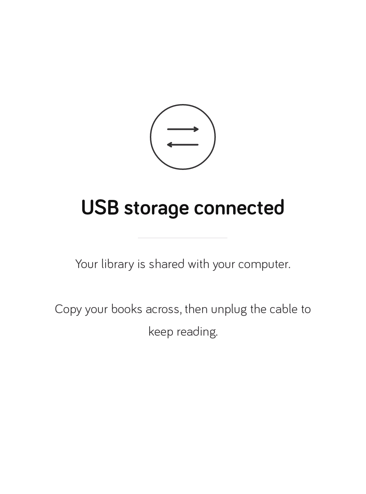

# Tolino Shine 3 — debloat, no store, no telemetry, KOReader as home

Turn a Tolino Shine 3 (`ntx_6sl`, Android 4.4.2, firmware 16.2.0) into a plain
local-EPUB reader: remove the shop/login/DRM/telemetry app, keep the hardware
working, and keep USB file transfer working without it.

Everything here was developed and verified on a real device. Every non-obvious
claim in these docs was tested rather than assumed — including several that
turned out to contradict the obvious reading. The traps are written down in
[`docs/findings.md`](docs/findings.md); **read that before you improvise.**

```
stock                                    after
─────────────────────────────────────    ──────────────────────────────────────
de.telekom.epub (shop, login, DRM,  ->   gone
  usage metrics) — also the launcher
SystemCrashReporter.apk              ->   gone
~41 MB retail demo content           ->   gone
sample wallpapers / screensaver      ->   gone
nerz.clone.sda.t-online.de           ->   blackholed in /etc/hosts
USB mass storage on cable plug       ->   provided by a 16 KB helper we wrote
launcher                             ->   KOReader
root                                 ->   still none (nothing is flashed)
```


*After the debloat: KOReader is the only launcher, reading position intact.*

---

## ⚠️ Read this first

**This modifies `/system` on a device you own.** It is reversible — you take a
full partition image first, and that image restores the device completely — but
you can absolutely end up with a device that does not boot if you skip steps or
run these scripts against the wrong firmware.

- **Nothing here flashes the bootloader.** The one genuinely unrecoverable
  action on this hardware is writing to `u-boot`; no script in this repo does
  that, and you should not either.
- Root is obtained by `fastboot boot` of a patched boot image. That is
  **RAM-only** and discarded on reboot, so no permanent root is required.
- The permission patch is a real security trade-off: afterwards *any* app can
  request `MOUNT_UNMOUNT_FILESYSTEMS`. On a single-purpose, sideload-only
  e-reader that is a reasonable trade. On a general-purpose device it is not.
- This is written against **one specific firmware (16.2.0 / build 157800)**. The
  scripts assert known checksums and refuse to run on anything else. That refusal
  is a feature.

---

## What is deliberately *not* in this repo

No vendor binaries, because they are proprietary and large. You supply them:

| You need | Where from |
|---|---|
| **A reader with its Debug menu enabled** (otherwise there is no adb — see below) | the reader itself: search page → `112358132fb` |
| Official 16.2.0 firmware `update.zip` | `https://download.pageplace.de/ereader/16.2.0/OS44/update.zip` |
| `adb`, `fastboot` | Android SDK platform-tools |
| `apktool` (not needed to run the pipeline) | optional, for poking at APKs |
| Android SDK build-tools + JDK 8+ | to build the helper |
| `e2fsprogs` (`e2fsck`, `resize2fs`, `dumpe2fs`, `debugfs`) | your distro |
| `cpio`, `python3`, `unzip` | your distro |
| KOReader APK | <https://github.com/koreader/koreader/releases> |

The repo contains only original scripts and documentation (MIT).

---

## Before anything: the reader must offer adb

**There is no adb until you enable the hidden Debug menu on the reader itself.**
It is off by default, and a factory restore removes it again — the `adb` flag
lives in `persist.sys.usb.config`, which is stored in `/data/property`, and a
restore rewrites `/data`.

On the reader's **search page**, type the code for your firmware and submit the
search:

| Firmware | Debug code |
|---|---|
| **16.x** | **`112358132fb`** |
| 15.x | `1123581321` |
| 14.x | `124816` |

The menu pages with the on-screen buttons; page 3 installs APKs from the reader's
storage root (which is itself a fallback for installing KOReader with no adb).

You can tell which side a problem is on without guessing — the USB product ID
changes with the gadget composition:

```
1f85:6053   mass storage only, no adb   ->  `adb devices` is empty
1f85:6052   mass_storage,adb            ->  the reader is listed
```

If you see `6053`, the device is not offering adb and nothing host-side will fix
it. More detail: [`docs/factory-restore.md`](docs/factory-restore.md).

---

## Quick start

```bash
# 0. ON THE READER FIRST: search page -> 112358132fb -> submit the search.
#    Then confirm the host can see it (expect 1f85:6052, not 6053):
adb devices

# 1. confirm you are talking to the right device
scripts/00-check-device.sh

# 2. get a stock boot image out of the official firmware
scripts/20-root.sh extract ~/Downloads/update.zip

# 3. build the RAM-only rooted image, boot it, wait for a root shell
scripts/20-root.sh build
scripts/20-root.sh boot

# 4. back everything up WHILE ROOTED (this is the important step)
scripts/10-backup.sh

# 5. MAKE SURE KOReader IS INSTALLED FIRST - EPubProd.apk is the stock launcher
adb install koreader.apk
# ... see docs/koreader-as-home.md ...

# 6. remove the store / telemetry / retail content
scripts/30-debloat.sh

# 7. make the permission grantable, and install the USB helper
scripts/31-patch-framework.sh
scripts/40-install-ums-helper.sh

# 8. reboot, then verify
adb reboot && sleep 45
scripts/00-check-device.sh
```

Then, optionally, build a system image you can restore through fastboot alone:

```bash
scripts/50-make-flashable-image.sh work/backups/system-partition-p5.img
```

---

## The step-by-step, with the reasoning

### 0. Identify the device — `scripts/00-check-device.sh`

Refuses to continue unless `ro.product.device` is `ntx_6sl`. This is the cheapest
possible protection against writing a Tolino image onto a different e-reader.

### 1. Get root without writing anything — `scripts/20-root.sh`

The stock `adbd` on this firmware is built **without `ALLOW_ADBD_ROOT`**, so
setting `ro.debuggable=1` is not enough — adbd unconditionally drops privileges.
The build script NOP-patches two instruction sequences inside `sbin/adbd`, which
reproduces byte-for-byte the patched adbd from the community root image
(`md5 98bbfe2462b221eedb944f72315df789`). The kernel is copied through
**byte-for-byte** on purpose: this model shipped with at least three different
touch controllers whose drivers are built into the kernel, so a mismatched
kernel is exactly what kills the touchscreen.

The hard part is timing, not patching. The bootloader only listens for a
fastboot command for about **5 seconds** after entering fastboot mode, so the
script arms `fastboot boot` *first* (it blocks on `< waiting for any device >`)
and only then triggers the device. `adb reboot bootloader` is a **no-op** on this
device; use `adb reboot fastboot`, or the physical route (power off → USB
connected → hold POWER ~30 s).

### 2. Back up before changing anything — `scripts/10-backup.sh`

Requires root, which is why step 1 comes first — the order is *root in RAM, then
back up, then modify*. Backing up reads block devices with `adb pull`, which
handles them correctly. (`adb exec-out` does **not** work against this KitKat
adbd — it fails with `error: closed`.)

Take `system-partition-p5.img` and `boot-partition-p1.img` somewhere that is not
the device. See [`docs/backup-restore.md`](docs/backup-restore.md).

### 3. Remove the store stack — `scripts/30-debloat.sh`

Removes `EPubProd.apk` (shop, login, Adobe/LCP DRM, usage metrics — and the
launcher), `SystemCrashReporter.apk`, the ~41 MB retail demo content, the AOSP
sample wallpapers and screensaver, and a dead `ota.conf`; and blackholes the
metrics host in `/etc/hosts`.

The script **checks for an alternative launcher first** and refuses to continue
otherwise, because removing `EPubProd.apk` with nothing to replace it leaves a
device that boots to an empty screen.

### 4. Make the permission grantable — `scripts/31-patch-framework.sh`

The helper needs `MOUNT_UNMOUNT_FILESYSTEMS`, declared `signature|system`. This
build's grant logic does not honour the `system` flag, so the permission is
unobtainable. The patch flips its `protectionLevel` from `0x12` to `0` inside
`framework-res.apk` — one attribute, one of 229 permissions.

The subtlety that makes it work at all: the APK's JAR signature goes stale when
we edit its manifest, but KitKat's `collectCertificatesLI()` **reuses the
signatures cached in `packages.xml` without re-verifying**, as long as the file's
`lastModified()` still matches the cached timestamp. So the script restores the
original mtime after pushing. Move the mtime and the signature is re-checked,
fails, and you have a broken framework.

The patch is **byte-deterministic**: stock `bfe142ca…` always yields
`f2aaeee092d30e8628214b300acc8798`. The script verifies both ends and refuses
anything else.

### 5. Install the USB helper — `scripts/40-install-ums-helper.sh`

`de.telekom.epub` was what called `setUsbMassStorageEnabled(true)` when the cable
was plugged in. Without it nothing ever shares a volume and the PC sees a
0-byte drive. MTP is not an option: this ROM's framework knows only
`audio_source`, `mass_storage` and `rndis`, and ships no `MtpService`.

So `ums-helper/` is a small app that does just that one thing, plus a static USB
screen so KOReader isn't frontmost while its storage volume belongs to the PC.
It is deliberately **not** a launcher (see [`docs/koreader-as-home.md`](docs/koreader-as-home.md)).



*The helper's USB screen. Fixed geometry throughout: plugging or unplugging the
cable swaps the glyph and the text but moves nothing — verified as byte-identical
screenshots across three boots.*

The script avoids two traps that cost real debugging time — the `/data/app`
update trap and the stale-odex trap. Both are explained in
[`docs/findings.md`](docs/findings.md).

### 6. Optional: a system image you can flash back — `scripts/50-make-flashable-image.sh`

The bootloader caps a single fastboot download at **352 MiB**
(`CONFIG_FASTBOOT_TRANSFER_BUF_SIZE`), and a full 384 MiB `/system` image is
rejected instantly with `FAILED (remote: '')`. Since `/system` only *uses*
~298 MB, this script shrinks the filesystem to fit while keeping ~80 MB free.
Flashing that through fastboot is a recovery path that needs **only the
bootloader** — it works even when Android will not boot.

---

## Going back

| You want | Do this |
|---|---|
| Undo the permission patch | `scripts/31-patch-framework.sh --revert` |
| Restore the whole debloated `/system` | `fastboot flash system <flashable>.img` |
| Restore the exact original `/system` | `dd` the raw image over `mmcblk0p5` from a rooted session |
| Go back to stock completely | the official `update.zip` via stock recovery |
| Root again, later | `scripts/20-root.sh boot` |

Details and the exact commands: [`docs/backup-restore.md`](docs/backup-restore.md).
For a full return to stock — including an audit of exactly which partitions the
official OTA writes on this hardware, and the adb-after-restore gotcha — see
[`docs/factory-restore.md`](docs/factory-restore.md).

---

## Known limitations — honestly

- **One unreproduced display crash.** A single `surfaceflinger` SIGSEGV was seen
  during a boot that also ran a dexopt and enabled USB storage early. Two cold
  boots — including one with those exact conditions — did not reproduce it. It
  self-heals via a runtime restart in ~20 s. Treat it as a rare vendor flake; if
  it recurs reliably, delay the helper's UMS enable at boot.
- **KOReader is not wipe-durable, and cannot cheaply be.** It is a `/data` app,
  so a factory reset removes it (one `adb install` restores it). Moving it to
  `/system/app` **breaks it**: its `MainActivity` is a `NativeActivity`, which
  resolves its native library through `nativeLibraryDir` — on this build always
  `/data/app-lib/<name>` — and never falls back to `/system/lib`. See
  `docs/findings.md` §5.
- **A factory reset does not touch your books.** The stock recovery's wipe path
  formats `/data` and `/cache` only; the user partition (p4) is not a wipe
  target. You will still need to reinstall KOReader into the emptied `/data`.
- **`/system` free space is 81 MiB with the shrunken image**, down from 121.7 MiB.
  That is the cost of fitting the fastboot cap and is ample in practice.

---

## Repo layout

```
scripts/           the pipeline, in order
  00-check-device  identity check (safe, read-only)
  10-backup        partition images (needs root)
  20-root          build + RAM-boot the rooted image; extract from firmware
  30-debloat       remove the store/telemetry/retail stack
  31-patch-framework  protectionLevel patch, mtime-preserving
  40-install-ums-helper  build + install into /system/app
  50-make-flashable-image  shrink a system image under the fastboot cap
root/              build-rooted-boot.sh, verify-rooted-boot.sh
framework-patch/   patch-axml.py (binary AXML), repack-apk.py
ums-helper/        the USB mass-storage helper: source, manifest, build.sh
docs/              findings.md (READ THIS), backup-restore.md,
                   troubleshooting.md, koreader-as-home.md,
                   factory-restore.md
```

## Prior art and credit

The root method follows the ALLESebook community guide for this device family
(temporary `fastboot boot` root, no security bypass, no exploit). The patched
`adbd` this repo reproduces is byte-identical to the one shipped in that
community image, which is a useful cross-check rather than a dependency.

## License

MIT — see [`LICENSE`](LICENSE). No vendor binaries are licensed or distributed
here.
