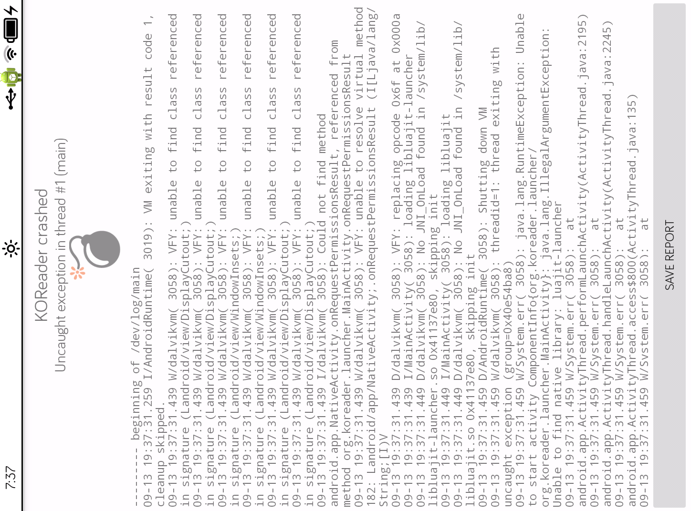

# Findings, traps, and things that are not what they look like

Everything here was verified on a real Tolino Shine 3. Several entries began as
a confident wrong assumption. **Read this before deviating from the scripts.**

Device: `ntx_6sl` · i.MX6SoloLite (1× Cortex-A9 ~1 GHz, NEON) · 465 MB RAM ·
Android 4.4.2 (KOT49H / build 157800) · firmware 16.2.0 · hardware `E60K00` ·
6″ e-ink 1072×1448 · SELinux **disabled** · no Bluetooth, no speaker, no microSD.

Partitions (`/proc/partitions`, cross-checked against the recovery fstab):

| Dev | Mount | Size |
|---|---|---|
| `mmcblk0p1` | `/boot` | 6,258,688 B |
| `mmcblk0p2` | `/recovery` | 32,768 KB |
| `mmcblk0p4` | `/storage/sdcard1` (books) | ~5.8 GiB |
| `mmcblk0p5` | `/system` | 402,644,992 B |
| `mmcblk0p6` | `/cache` | 393,208 KB |
| `mmcblk0p7` | `/data` | 524,280 KB |
| `mmcblk0p10` | `/share` (recovery payload) | 262,144 KB |

---

## 1. Patching `ro.debuggable` is not enough — `adbd` must be patched in the binary

The obvious approach — set `ro.debuggable=1`/`ro.secure=0` in the ramdisk's
`default.prop` and expect `adb root` — **does nothing**. The vendor compiled
`adbd` without `ALLOW_ADBD_ROOT`, so the authorization branch is not simply
gated on those properties; adbd drops privileges unconditionally.

The fix is to NOP out two instruction sequences inside `sbin/adbd`:

- the `setgroups`/`setgid`/`setuid` block — 24 bytes → 12 Thumb NOPs (`00 bf`)
- `prctl(PR_CAPBSET_DROP)` — 4 bytes → 2 NOPs

The result is byte-identical (`md5 98bbfe2462b221eedb944f72315df789`) to the
patched `adbd` in the community root image, which is a genuinely useful
independent check. Stock `adbd` is identical from 14.1.0 through 16.2.0
(`md5 1d23e203eba05102e6cb642a117b8d64`), so the same patch applies across the
whole firmware range.

**Do not confuse `size unchanged` with `unpatched`.** A NOP patch replaces bytes
1:1, so the file size never changes. Compare hashes.

## 2. The kernel must be copied byte-for-byte

This model shipped with at least three different touch controllers (Cypress
`cyttsp5_mt`, STMicro `fts`, Elan). Their drivers are built **into the kernel**,
not loaded as modules — so booting a kernel from a different variant is exactly
what kills the touchscreen. `build-rooted-boot.sh` copies the kernel through
untouched and changes only the ramdisk.

## 3. Fastboot: the 5-second window, and what actually works

- **`adb reboot bootloader` is a no-op.** The vendor kernel maps only
  `"download"`, `"recovery"` and `"fastboot"`. Use **`adb reboot fastboot`**
  (confirmed working).
- **The bootloader accepts a fastboot command for only ~5 seconds** after
  entering fastboot mode. So *arm the fastboot command first* — start it and let
  it block on `< waiting for any device >` — and only then trigger the device.
  Reversing that order is the single most common cause of "fastboot sees
  nothing".
- The fastboot gadget identifies as **`18d1:0d02`**, manufacturer string
  **"Freescale"**. That is fastboot, not the SoC ROM recovery mode
  (`15a2:0063`) — do not walk away from a "Freescale" device assuming it is
  something else.
- Physical entry: power fully off → USB connected → hold POWER **continuously
  ~30 s** (`ntx_wait_powerkey(30,1,1)`) — but with a fastboot command already
  waiting.
- `fastboot getvar` is **not implemented** (`unknown var`), so you cannot query
  partition sizes from the bootloader. The `version` var returns `0.5`.

### 3a. 352 MiB download cap — why a full `/system` image will not flash

```c
/* include/configs/mx6sl_ntx_android.h */
#define CONFIG_FASTBOOT_TRANSFER_BUF_SIZE 0x16000000 /* 352M byte */

/* drivers/fastboot/fastboot.c:1086 */
if (g_fastboot_datalen > CONFIG_FASTBOOT_TRANSFER_BUF_SIZE) {
        DBG_ERR("Download too much data");   /* -> sends "FAIL" */
```

An image over 369,098,752 bytes is rejected **instantly** —
`Sending 'system' (393208 KB) FAILED (remote: '')` in 0.048 s, before any
transfer. It is a size rejection, **not** a missing partition: `fastboot flash
boot` with a 4.5 MB image returns `OKAY` on the same bootloader.

There is **no sparse-image support** in this U-Boot — nothing matching `sparse`
exists in its fastboot code. Feeding it an Android sparse image would write the
container raw and destroy the partition. Do not try it.

Fix: shrink the filesystem (`scripts/50-make-flashable-image.sh`). A filesystem
smaller than its partition is legal; the tail is simply unused.

### 3b. `fastboot flash` writes; it does not erase

The eMMC path is a plain `mmc write` of exactly the image length at the
partition start, and `fastboot erase` is not implemented for eMMC
(`"Not support erase command for EMMC"`). Consequence: flashing a small image to
a partition leaves the tail of the old content untouched — harmless, and it means
flashing a byte-identical image is a genuine no-op.

## 4. KitKat reuses cached APK signatures — if and only if the mtime matches

`PackageManagerService.collectCertificatesLI()` short-circuits:

```
codePath.equals(...) && timeStamp == lastModified() && signatures != null
```

So a system APK whose JAR signature has gone stale still loads, as long as its
`lastModified()` still equals the cached timestamp. This is what makes editing
`framework-res.apk` possible without Telekom's signing key — and it is fragile:
change the mtime and PMS re-verifies, the signature fails, and the framework
breaks. Always restore the mtime (`busybox touch -r` against a `cp -p` copy).

Note this cuts both ways — see the odex trap below, where the same
timestamp-based caching works *against* you.

## 5. The `/data/app` update trap (and why "installed" is ambiguous)

Because the base package is a *system* app, PMS permits any same-signature update
with a **strictly higher `versionCode`** to install into `/data/app` **with no
privileges at all** — a plain `adb install -r` from a uid-2000 shell.

That is convenient for iterating and silently wrong for durability: `pm path`
then resolves to `/data/app`, and a factory reset reverts to whatever stale build
lives in `/system/app`.

The same rule seen from the other side: `new version 1 better than installed 1`
is PMS rejecting an **equal** versionCode, not a signature or permission problem.

**After any change, check `pm path`. If it says `/data/app`, it is not durable.**
And remember those libs must live in `/data/app-lib/<name>` for native code to
load — so for apps with native libraries, "durable" is not achievable by
relocation at all (see §7).

## 6. The stale-odex trap

After replacing a system APK in place, delete
`/data/dalvik-cache/system@app@<Name>.apk@classes.dex`.

KitKat decides whether a cached dex is current from the APK's **mtime and size**,
and `adb push` carries the *build machine's* mtime. So a swapped APK can keep
running the old code. The tell-tale symptom is nasty: **`versionCode` reads
correctly from the manifest while the screen shows old behaviour.** Deleting the
file forces a re-dexopt at boot.

## 7. `NativeActivity` resolves libraries through `nativeLibraryDir` only

**This is the one that broke KOReader.** Moving its APK to `/system/app` made it
crash on every launch with:

```
java.lang.IllegalArgumentException: Unable to find native library: luajit-launcher
```

KOReader's `MainActivity` is a `NativeActivity`. Unlike `System.loadLibrary`
(which falls back to the linker's default path including `/system/lib`),
`NativeActivity` loads `<nativeLibraryDir>/lib<name>.so` by **absolute path, with
no fallback**. And on this build `nativeLibraryDir` is `/data/app-lib/<name>` for
**every** package.



*KOReader catches its own crashes and displays the log — which is how the real
cause was found after logcat had already rotated. A screenshot read the exception
straight off the panel.*

Evidence that this is a property of the build, not of one app — every package,
including pristine system APKs with no `/data` history:

```
com.android.systemui   /system/priv-app/SystemUI.apk    -> /data/app-lib/SystemUI
com.android.settings   /system/priv-app/Settings.apk    -> /data/app-lib/Settings
com.android.keyguard   /system/priv-app/Keyguard.apk    -> /data/app-lib/Keyguard
ntx.PowerEnhance       /system/app/PowerEnhance.apk     -> /data/app-lib/PowerEnhance
```

And **this build does not populate `/data/app-lib` for system apps**.
`PowerEnhance.apk` ships `lib/armeabi-v7a/libepd.so`, yet
`/data/app-lib/PowerEnhance` does not exist — its libraries are found in
`/system/lib`. `SystemUI.apk` ships no libraries at all and still reports a
`/data/app-lib` path, which shows the path is assigned unconditionally.

**Rules that follow:**

- Relocating an APK into `/system` is only safe for **pure-Java** apps. The
  helper is pure Java, which is why the same trick worked for it and destroyed
  KOReader.
- Putting a `NativeActivity` app's libraries in `/system/lib` does **not** help.
- A `NativeActivity` app can only be made durable by making
  `/data/app-lib/<name>` exist at every boot — which requires a boot-ramdisk
  init hook and therefore a **flashed** boot image. Not worth it when restoring
  from a PC takes one command.

## 8. The permission grant logic ignores the `system` flag

`MOUNT_UNMOUNT_FILESYSTEMS` is `protectionLevel="signature|system"` (`0x12`), and
this build refuses it for anything not platform-signed:

```
W/PackageManager: Not granting permission android.permission.MOUNT_UNMOUNT_FILESYSTEMS
    to package org.tolino.umshelper (protectionLevel=18 flags=0x8be45)
```

`protectionLevel` is a bitfield; clearing it to `0` makes the permission
`normal`. That is the entire framework patch. Trade-off: any app can then request
it.

## 9. `adb` quirks on this firmware

- **`adb exec-out` does not work** — fails with `error: closed`. Use
  `adb shell` for text and `adb pull` for binary.
- **`adb pull` reads block devices correctly** (`adb pull /dev/block/mmcblk0p5`),
  which is how the backups are taken. No TWRP required.
- **`/dev/bus/usb` may not exist inside a container/sandbox**, so `fastboot`
  cannot reach the device from there even though `lsusb` works. `adb` can, via a
  host adb server (`ADB_SERVER_SOCKET`). Partition pulls still work because they
  go over that adb connection.
- **Missing device tools:** `which`, `uname`, `sha256sum`, `head`, `wc`. Present:
  `md5`, `busybox`, `gzip`, `dd`, `cpio`, `stat`-lite. Do not build scripts on
  the assumption of a normal userland — and note that a failed `which` looks like
  "tool absent" even when the tool exists.

## 10. USB mass storage takes the volume away from Android

Enabling UMS removes `/storage/sdcard1` from Android, and KOReader then dies with:

```
java.lang.SecurityException: Invalid mkdirs path:
    /mnt/media_rw/sdcard1/Android/data/org.koreader.launcher/files/
```

So the helper must **stop KOReader before** sharing the volume, show its own
static screen while shared (the screen must not touch storage), and only relaunch
KOReader once the volume is genuinely back — checking both `!isVolumeShared()`
and the mount state, not just sleeping.

Two related traps:

- **Never broadcast a sticky `USB_STATE`.** It replays at boot, which shares
  storage before KOReader can start and produces a crash loop. Use the explicit
  `UMS_CONNECTED` / `UMS_DISCONNECTED` actions only.
- **`StorageManager.setUsbMassStorageEnabled` does not exist** on this build —
  calling it throws `NoSuchMethodException`. Use the binder call through
  `ServiceManager.getService("mount")` and `IMountService$Stub.asInterface`.

## 11. What a factory reset actually wipes

From the stock recovery binary's strings, the wipe paths are:

```
/data    -> "Data wipe complete."
/cache   -> "Cache wipe complete."
/sdcard  -> appears only as a source for update.zip / show_welcome_emergency
```

So `wipe_data` formats p7 and `wipe_cache` formats p6. The user partition p4
(your books, and KOReader's own `settings.reader.lua`) is mounted in recovery as
`/mnt/media_rw/sdcard1` and is **not** a wipe target. KitKat also exposes "Erase
SD card" as a separate, off-by-default option.

Consequence: after a factory reset your library survives, `/system` is untouched,
and the only thing you must redo is reinstalling apps that lived in `/data`
(KOReader) — one `adb install`.

## 12. What is deliberately left installed

`ntx.PowerEnhance`, `com.ntx.msg` (power, e-ink and the low-battery/suspend
dialogs), `/system/bin/hw_check.sh` (selects the touch controller at boot),
`ntx_hwconfig-static`, `epd_ctrl`, `powerdebug`, `libepd.so` / `libpower*.so`,
`display_mode_fb*.conf`, `/system/usr/sleep/` and `/system/fonts`. These are
proprietary but load-bearing — removing them risks the panel, power management or
suspend. The 34 MB of fonts is mostly Tolino reading fonts that nothing now uses,
but there is no space pressure worth the risk.

The sleep cover works at the **framework** level (`SW_LID` →
`notifyLidSwitchChanged`), not in the store app, so removing the store app does
**not** break it.
